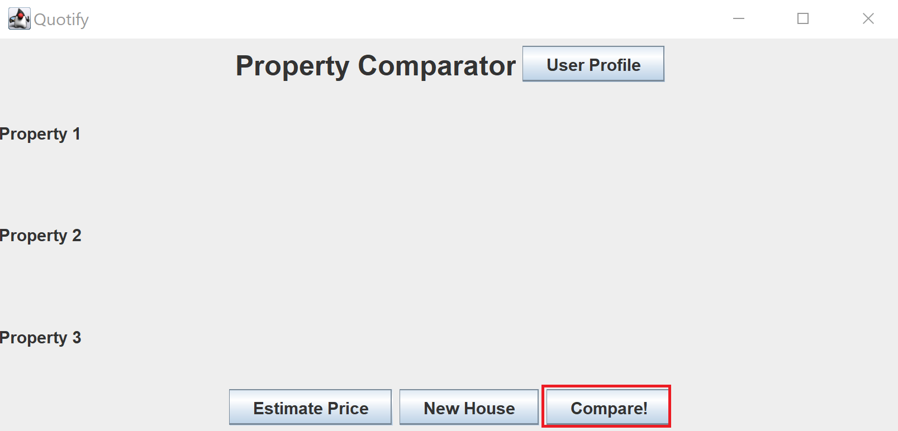

<!-- Improved compatibility of back to top link: See: https://github.com/othneildrew/Best-README-Template/pull/73 -->
<a id="readme-top"></a>
<!--
*** Thanks for checking out the Best-README-Template. If you have a suggestion
*** that would make this better, please fork the repo and create a pull request
*** or simply open an issue with the tag "enhancement".
*** Don't forget to give the project a star!
*** Thanks again! Now go create something AMAZING! :D
-->


<!-- PROJECT SHIELDS -->
<!--
*** I'm using markdown "reference style" links for readability.
*** Reference links are enclosed in brackets [ ] instead of parentheses ( ).
*** See the bottom of this document for the declaration of the reference variables
*** for contributors-url, forks-url, etc. This is an optional, concise syntax you may use.
*** https://www.markdownguide.org/basic-syntax/#reference-style-links
-->
=


<h1 align="center">Quotify</h1>

  <p align="center">
    A Java Application to better inform those interested in market trends for properties
    
    
    
  </p>
</div>


<!-- TABLE OF CONTENTS -->
<details>
  <summary>Table of Contents</summary>
  <ol>
    <li>
      <a href="#about-the-project">About The Project</a>
      <ul>
        <li><a href="#project-summary">Project Summary</a></li>
        <li><a href="#built-with">Built With</a></li>
      </ul>
    </li>
    <li>
      <a href="#getting-started">Getting Started</a>
      <ul>
        <li><a href="#prerequisites">Prerequisites</a></li>
        <li><a href="#installation">Installation</a></li>
      </ul>
    </li>
    <li><a href="#usage">Usage</a></li>
    <li><a href="#roadmap">Roadmap</a></li>
    <li><a href="#contributing">Contributing</a></li>
    <li><a href="#license">License</a></li>
    <li><a href="#contact">Contact</a></li>
    <li><a href="#acknowledgments">Acknowledgments</a></li>
  </ol>
</details>


</p>


### Built With

- Java 23
- Java Swing
- Vertex AI
- ATTOM Housing Data 
- SQLite

<p align="right">(<a href="#readme-top">back to top</a>)</p>

## Project Summary
The purpose of this project was to allow users interested in learning more about their properties to gain insight in two major directions:
* Price Prediction: One of Quotify App's main bits of functionality is to allow a user to see predicted current and future price points for a given property
    * Users are given predicted valuations of a certain property up to a range of 6 months from the present
    * The prediction of prices is done with a custom regression model trained on housing data acquired from ATTOM.

* Property Comparison: The other main feature of the application is to allow users to compare their property with other properties on the market that have similar features.
    * Properties in the same zipcode are scored in their similarities based on a custom algorithm and the top 3 most similar properties are displayed back to the user

Note that anyone at all interested in properties in the United States is more than welcome to try out our app and gain some insight about the performance of certain properties, there is no limitation to just homeowners and renters!

<!-- GETTING STARTED -->
## Getting Started

This is an example of how you may give instructions on setting up your project locally.
To get a local copy up and running follow these simple example steps.

### Prerequisites

This is an example of how to list things you need to use the software and how to install them.
* Maven: Install Maven on your IDE of choice or follow the instructions in the link below to install Maven/
  ```sh
  https://maven.apache.org/install.html
  ```
* Java 23: Make sure this is the version of Java currently installed on your machine to avoid any compilation issues
* ATTOM API key: make sure to register with ATTOM for an API key, our app makes use of their data and one needs an 
api key to make these calls!
* The app is functional on any OS: (Windows, Unix-based, MacOS)

### Installation


1. Clone the repo
   ```sh
   git clone https://github.com/samnjab/Quotify.git
   ```
2. All the necessary dependencies are located in our ```pom.xml``` file, check there to make sure you're not missing anything
3. Insert your Attom API key in the ```src/main/java/quotify_app/dataaccess``` directory into :
   ```sh
    AttomClient.java
   ```
4. Change git remote url to avoid accidental pushes to base project
   ```sh
   git remote set-url origin github_username/repo_name
   git remote -v # confirm the changes
   ```
5. Run Main.main() and you're good to go!

<p align="right">(<a href="#readme-top">back to top</a>)</p>

- Common Issues: 
  - Using an IDE like IntelliJ IDEA with Maven will sometimes result in horrendous bugs with resolving dependencies, here are some solutions:
    * Reloading the Maven project from the IDE menu
    * Invalidating caches in IntelliJ and attempting to restart the client
    * Re-cloning the repository
    * Praying...

<!-- USAGE EXAMPLES -->
## Usage

<i> Here, we'll walk the user through using the application: </i>
<br></br>
Starting with the landing page of the application, where you fill in your property information, there is something to consider:
<br></br>
We use the Attom API to figure out which fields they have available for each drop-down option so it might take a while for each menu to load
<br></br>


Next, the Price Prediction and Price Comparison use cases:
* Price Prediction
  * The first thing to note here is that our training data was extremely limited for the first iteration of this project
  * As a result, only properties within certain zipcodes in New York State result in valid predictions
  * After choosing the functionality you'd like from the app (either Prediction or Comparison), on either of the prediction pages one can choose to display the respective prediction result by clicking the button on the screen
  
* Before Predicting:


* After Predicting:


* Price Comparison usecase:
  * Choosing the other option allows you compare your input property to similar nearby properties
  * In order to find nearby properties to a given property, we also use Attom's API, which tends to be limited in more remote areas, so that may be a limitation for some users seeking information on remote properties
  * Going through the usecase involves clicking a button to calculate and reveal the similar properties

* Before Comparing:



* After Comparing:


<p align="right">(<a href="#readme-top">back to top</a>)</p>


<!-- ROADMAP -->
## Roadmap

Our next steps include:
* Extending our price prediction model to include a larger portion of the United States to make price prediction more accessible
* Finding an alternative to query nearby properties to a given property to also make Comparing Properties more accessible
* Adding a feature for users to view previously queried properties and computed results


<!-- CONTRIBUTING -->
## Contributing

Contributions are what make the open source community such an amazing place to learn, inspire, and create. Any contributions you make are **greatly appreciated**.

If you have a suggestion that would make this better, please fork the repo and create a pull request. You can also simply open an issue with the tag "enhancement".
Don't forget to give the project a star! Thanks again!

1. Fork the Project
2. Create your Feature Branch (`git checkout -b feature/AmazingFeature`)
3. Commit your Changes (`git commit -m 'Add some AmazingFeature'`)
4. Push to the Branch (`git push origin feature/AmazingFeature`)
5. Open a Pull Request

<p align="right">(<a href="#readme-top">back to top</a>)</p>

<!-- LICENSE -->
## License

Distributed under the MIT License. See `LICENSE.txt` for more information.

<p align="right">(<a href="#readme-top">back to top</a>)</p>

<!-- ACKNOWLEDGMENTS -->
## Acknowledgments
The following contributors developed this project:

* [Cristian Solomon]()
* [Alex Farhood]()
* [Christine Liu]()
* [Sam Jaberi]()
* [Hadi Ahmed]()

<p align="right">(<a href="#readme-top">back to top</a>)</p>

